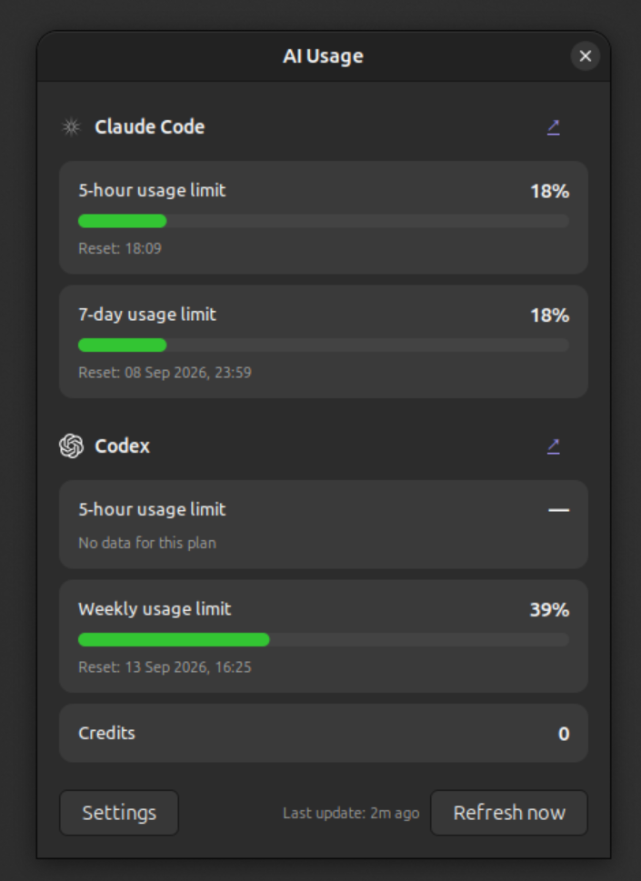
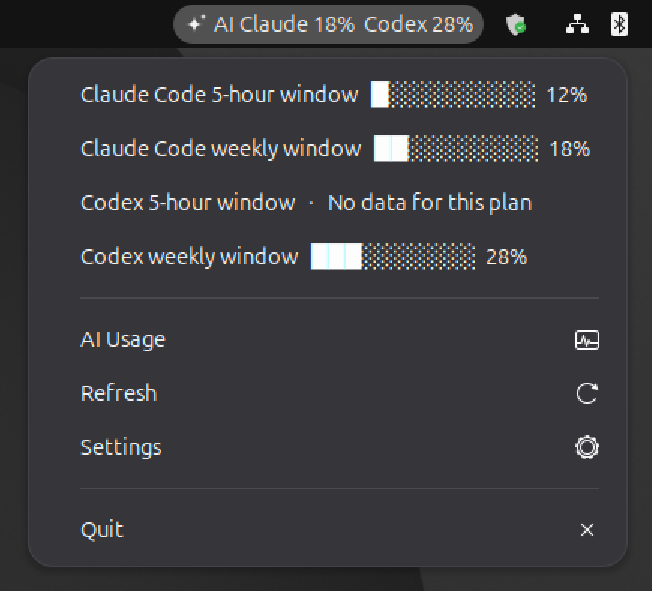
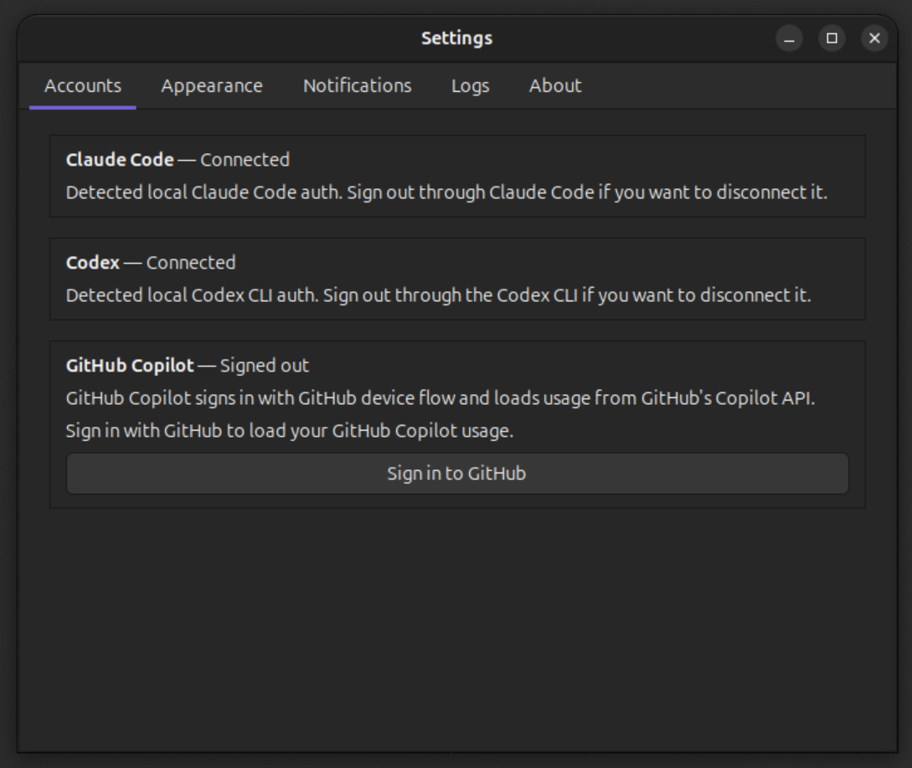

# AI Usage

GNOME tray application for tracking Claude, Codex, and GitHub Copilot usage limits on Linux.

## Screenshots



| Tray menu | Settings |
| --- | --- |
|  |  |

## Features

- GNOME system tray icon showing consumed usage per provider (`AI Claude 18% Codex 28%`).
- Tray menu lists each usage window with a progress bar; click a row or the panel item to open the full usage panel. Middle-clicking the tray icon opens it directly.
- Claude tracking for 5-hour and 7-day usage windows.
- Codex tracking for 5-hour, weekly, spark, and credit usage.
- GitHub Copilot monthly quota tracking.
- Configurable refresh cadence, visible providers, and language (English / Polish).
- Desktop notifications for ahead/behind-schedule usage and early resets.
- Credentials stored securely in GNOME Keyring via libsecret.
- Settings window with tabs for Accounts, Appearance, Notifications, Logs, and About.

## Requirements

- Ubuntu 22.04+ (or any Linux with GNOME / AppIndicator support)
- Python 3.10+
- System packages:

```bash
sudo apt install gir1.2-appindicator3-0.1 gir1.2-notify-0.7 \
    libsecret-1-dev python3-gi python3-gi-cairo gir1.2-gtk-3.0
```

## Install

```bash
pip install -e .
```

## Run

```bash
ai-usage
```

Or directly:

```bash
python -m ai_usage.main
```

## Authentication

### Codex

1. Run `codex login` in your terminal.
2. The app detects `~/.codex/auth.json` automatically.

### Claude

1. Run `claude` in your terminal and complete sign-in.
2. The app detects `~/.claude/.credentials.json` automatically.

### GitHub Copilot

1. Open Settings > Accounts in the app.
2. Click "Sign in to GitHub".
3. Complete the device flow in your browser.
4. The token is stored in GNOME Keyring.

## Data Sources

- Codex: local CLI auth from `~/.codex/auth.json`, usage from the Codex API.
- Claude: local Claude Code OAuth from `~/.claude/.credentials.json`, usage from Anthropic's API.
- Copilot: GitHub device flow OAuth, usage from GitHub's internal Copilot API.

## Legal

The OpenAI logo, Claude logo, and GitHub Copilot logo are used only to identify their respective services. All trademarks belong to their respective owners. This project is independent and not affiliated with OpenAI, Anthropic, or GitHub.
